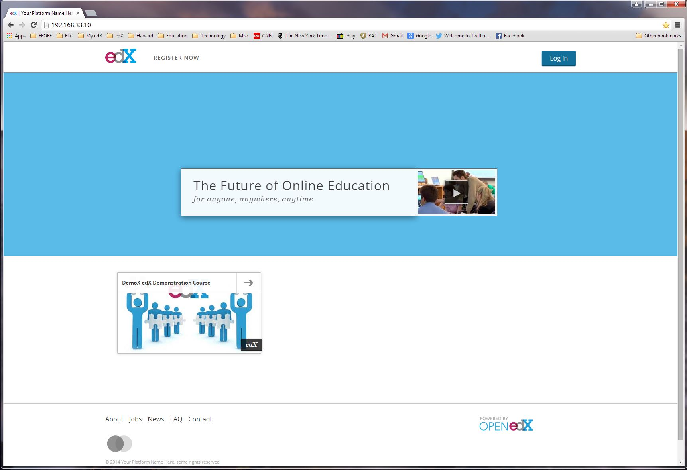

1. Introduction
===============
This section provides an introduction to installing Open edX on a single stand-alone computer.

Open edX is the software that powers edX-related online learning websites.

Open edX includes both a:
 - Learning management system (LMS) for users to sign up, and register and take courses.
 - Content management system (CMS), called Studio, to allow content providers to develop and publish content.

The edX environment has been developed using open source software. Open source software is software that has been licensed to be used by the general public for free.

edX software utilizes more than twenty four open source software languages, utilities, and technologies.

The operating system on which edX is based is Ubuntu, an open source Linux variant. The primary base programming language used to create edX is python.

Open edX provides scripts and documentation that can be used to install the Open edX environment.

|
The Goal
--------

The ultimate goal of this documentation is to help you create a working instance of Open edX on a single computer, whereby a content developer could immediately use it to develop Open edX courses.

These instructions will describe the steps suggested to install a copy of the Aspen.1 production release of Open edX on a single Windows 7 Enterprise based personal computer.

|
The Overall Process
-------------------

The overall installation process will involve the following major steps:
 #. Install the host operating system, Windows 7 Enterprise Service Pack 1, and enable the Network File System (NFS) service.
 #. Download additional required software. 
 #. Install the Oracle Virtual Box virtualization package.
 #. Install the Vagrant provisioning and configuration package.
 #. Install the cURL for Windows command line-based file transfer program.
 #. Use Vagrant to download and install the Open edX environment.
 #. Install additional useful software utilities.
 #. Install and configure the mail system software.
 #. Install and configure the Open edX-related Stanford Custom Theme.
 
| 
The Result
----------

After successfully installing the Open edX environment, you will have the ability to:
 #. Login to the Learning Management System (LMS).
 #. Login to the Content Management System (CMS), called Studio.
 #. Register as a new user (as a student or staff member).
 #. Register for a course (as a student or staff member).
 #. Create new courses and content as a content provider and publisher.
 #. Access the edX content from a browser running on your host operating system.
 
 These steps will not necessarily make the courses available to anyone else, on the internet or otherwise.
 
 More configuration will be necessarily for that.
 
 The courses developed using this system could, however, be exported and then imported into a system that is accessible from the internet.
