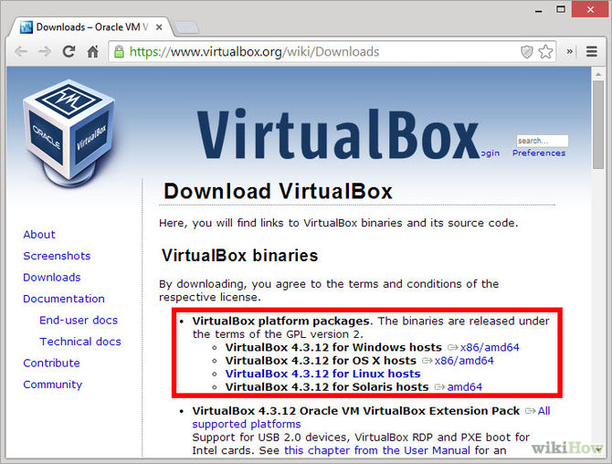

4. Install Oracle VirtualBox
============================

Background
^^^^^^^^^^

Oracle VirtualBox is open source software that allows you to install additional operating systems onto your computer.

VirtualBox extends the capabilities of your existing computer so that it can run multiple operating systems (inside multiple virtual machines) at the same time.

Oracle VirtualBox Download Page
-------------------------------

(This image shows version 4.3.12, but we will not use that version)

|
Oracle VirtualBox Version for edX Installation
---------------------------------------------

To install Open edX, we will use Oracle VirtualBox Version 4.3.16, and the companion extension pack for it.

Note that earlier, or even more recent, versions of this package might not be compatible with the rest of the platform. So, be sure to get this version, in particular.

The homepage for Oracle VirtualBox is here: https://www.virtualbox.org/

You can find the versions you need for 64-bit Windows 7 here:

- http://download.virtualbox.org/virtualbox/4.3.16/VirtualBox-4.3.16-95972-Win.exe 
- http://download.virtualbox.org/virtualbox/4.3.16/Oracle_VM_Virtualx_Extension_Pack-4.3.16-95972.vbox-extpack

|
Installing VirtualBox
^^^^^^^^^^^^^^^^^^^^^

1. Click the previously downloaded VirtualBox-4.3.16-95972-Win.exe setup program.
2. Follow the prompts to install. Accept all of the default option settings.

